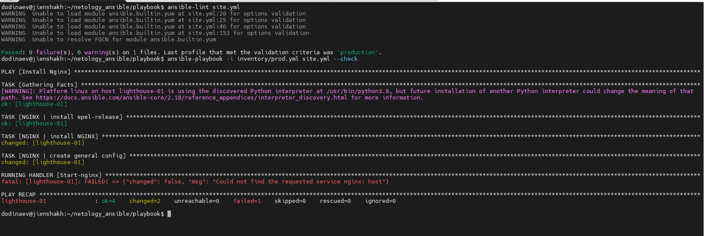

# Домашнее задание к занятию 3 «Использование Ansible»



[Первый запуск playbook  флагом `--diff`](stdout/ansible-playbook-stdout-diff1.md)

[Второй запуск playbook  флагом `--diff`](stdout/ansible-playbook-stdout-diff2.md)

## Описание

Этот playbook автоматизирует развертывание стека для сбора и анализа логов:

*   **ClickHouse** — высокопроизводительная колоночная СУБД для хранения логов
*   **Vector** — сборщик и обработчик логов с отправкой в ClickHouse
*   **Nginx + Lighthouse** — веб-сервер с интерфейсом мониторинга

Архитектура: **Vector** (сбор логов) → **ClickHouse** (хранение) ← **Lighthouse** (визуализация)

## Структура проекта

```
.
├── group_vars/
│   ├── clickhouse/
│   │   └── vars.yml          # Переменные ClickHouse
│   ├── vector/
│   │   └── vars.yml          # Переменные Vector
│   └── lighthouse/
│       └── vars.yml          # Переменные Nginx/Lighthouse
├── inventory/
│   └── prod.yml              # Инвентарь с хостами
├── templates/
│   ├── nginx.conf.j2         # Конфиг Nginx
│   ├── lighthouse.conf.j2    # Конфиг Lighthouse
│   └── vector.yaml.j2        # Конфиг Vector
├── site.yml                  # Основной playbook
└── uninstall_all.yml         # Playbook для удаления
```

## Теги

Playbook поддерживает выборочный запуск компонентов:

*   **`clickhouse`** — установка ClickHouse
*   **`vector`** — установка Vector
*   **`nginx`** — установка Nginx
*   **`lighthouse`** — установка Lighthouse

## Использование

### Полная установка:
```bash
ansible-playbook -i inventory/prod.yml site.yml
```

### Установка отдельных компонентов:

#### Только ClickHouse
```bash
ansible-playbook -i inventory/prod.yml site.yml --tags clickhouse
```

#### Только Vector
```bash
ansible-playbook -i inventory/prod.yml site.yml --tags vector
```

#### Только Nginx и Lighthouse
```bash
ansible-playbook -i inventory/prod.yml site.yml --tags nginx,lighthouse
```

## Удаление

### Полное удаление стека:

```bash
ansible-playbook -i inventory/prod.yml uninstall_all.yml
```

### Выборочное удаление:

#### Удалить только Vector

```bash
ansible-playbook -i inventory/prod.yml uninstall_all.yml --tags vector
```

#### Удалить только ClickHouse

```bash
ansible-playbook -i inventory/prod.yml uninstall_all.yml --tags clickhouse
```